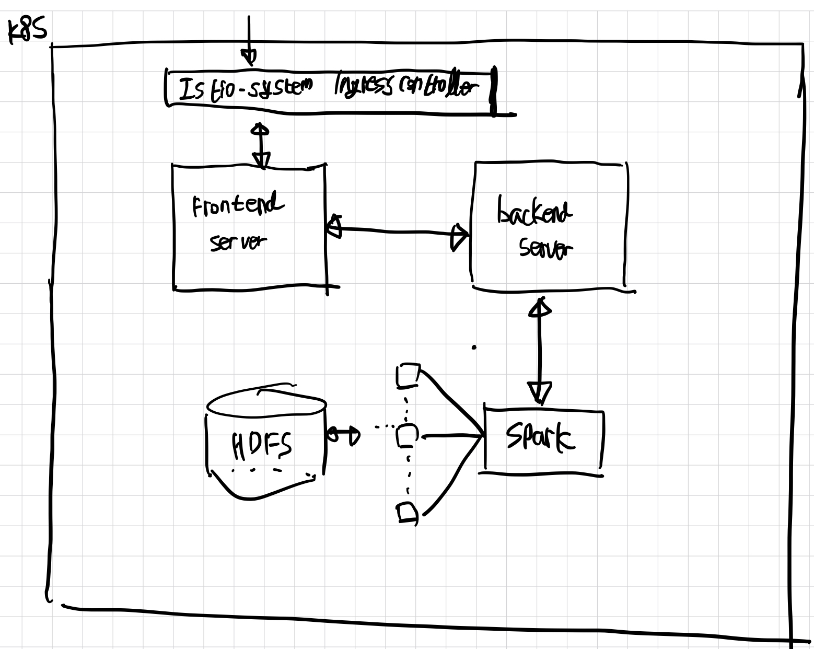

# trader-system

<<<<<<< HEAD
=======
- Prototype Architecture (ver1)


>>>>>>> eb3f7ca (pro_ver1)Dev Setting - frontend,backend)

### Local Debuging/Dev Environment
1. git clone the repository

2. ``` cd trader-system ```

3. ``` direnv allow ```

    [reference URL](https://sincerity-dev.tistory.com/2)

4. ``` cd web-werver ```

5. ``` docker compose up ```

    - Real Time Debugging is available.
    - you need ***docker and docker-compose*** for dev

### Release Pipeline
1차 프로토타입 완성 이후에 무중단 자동화 파이프라인 구축 예정

-> ArgoCD, AWS services, Github, Canari Deployment